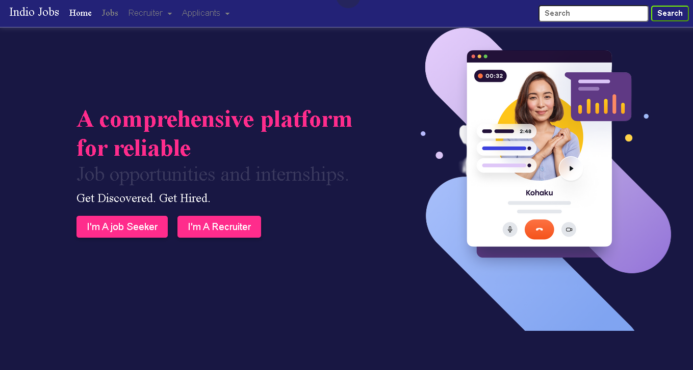
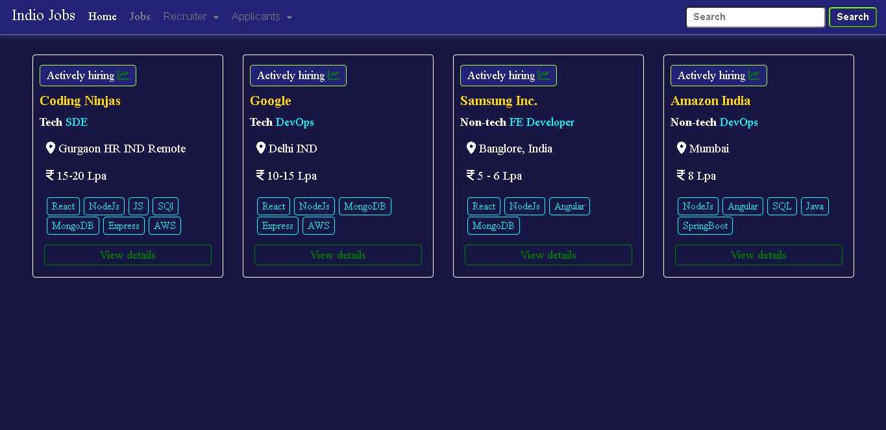

# India-Job Project

## 🚀 Overview
**India Job** is a job portal platform tailored for Indian users, enabling job search, posting, and applications. It features efficient filtering, a responsive design, and a user-friendly interface. The project demonstrates strong full-stack development skills, focusing on accessibility, performance, and real-world usability for job seekers and employers.

---

## 🛠 Tech Stack
### **Frontend**
- EJS

### **Backend**
- Node.js & Express
- REST API
- JWT Authentication

### **Database**
- MongoDB

### **Others**
- Cloud Storage (MongDb ATLAS)
- Render (backend)

---

## ✨ Features
### Frontend
- Responsive UI with modern design.
- Implemented **JWT Authentication** Secure API.
- Integrated job CRUD and search functinality.
- Allow recruiters to view applications.
- Provided users a dashboard.

### Backend
- RESTful API with USER & Recuriter signup & signin functinalities
- Authentication & Authorization (JWT)
- Secure data handling & validations

---

## 📂 Project Structure
```
project-root/
│
├── backend/       # Backend code (Node.js/Express)
└── README.md     # This file
```
---

## 🚀 Deployment
- **Backend:** Hosted on Render  
- **Database:** MongoDB Atlas  

---

The project is live!  
👉 **[View Live Demo](https://indio-job.onrender.com/home)**

---

## 📸 Screenshots



---

## 📞 Contact
- **Author:** Suraj Nishad
- **Email:** iamsuraj0737@gmail.com
